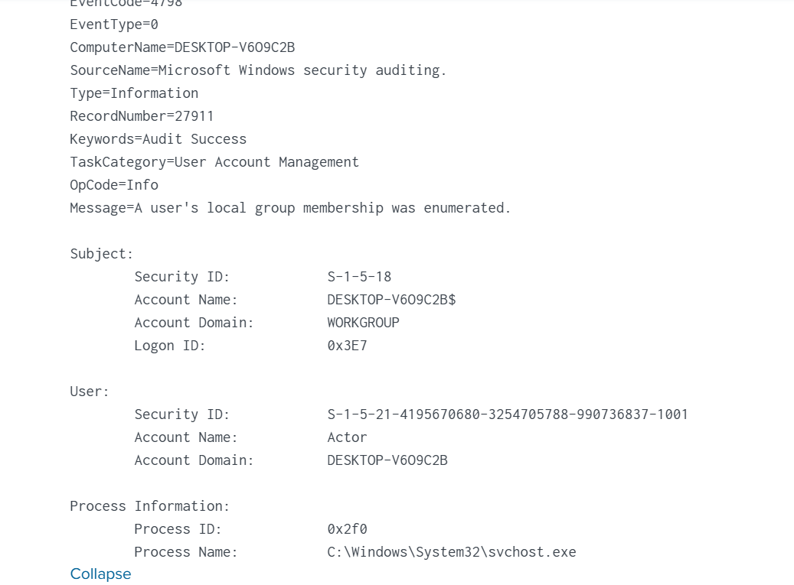
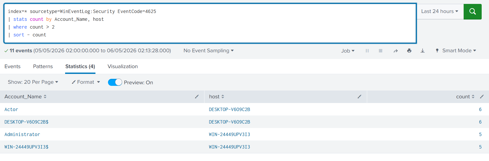
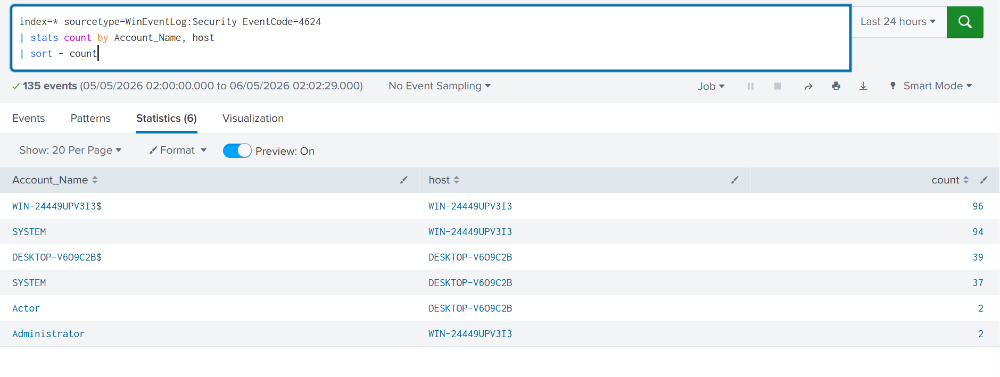
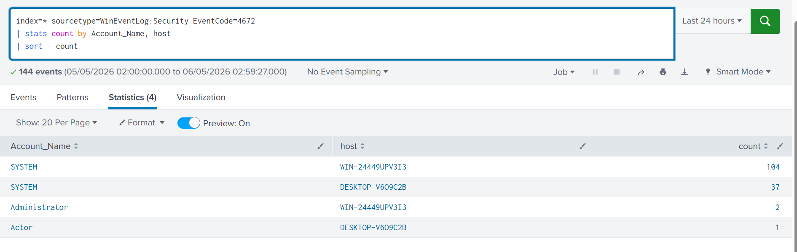
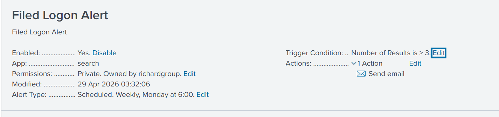
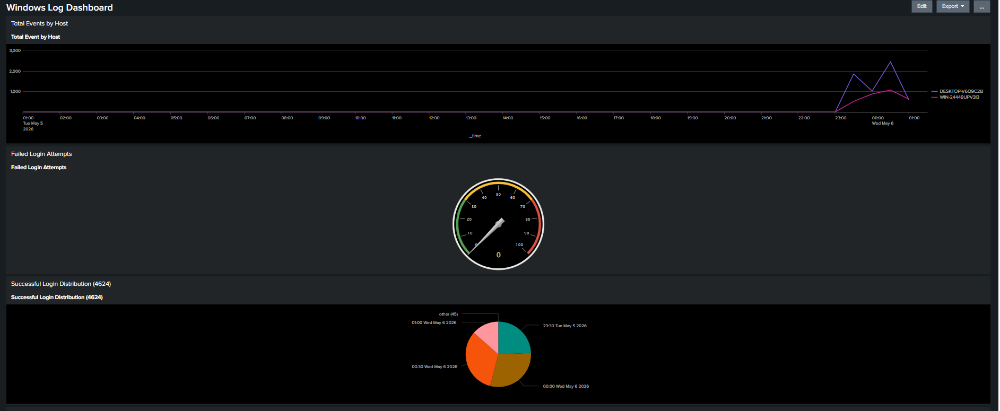

# 🔐 Windows Authentication Monitoring with Splunk

## 📌 Overview

This project explores how Windows Security Event Logs behave in a controlled lab environment using Splunk, with a focus on authentication activity, failed logins, and detection challenges.

Rather than simply collecting logs, this project aims to answer a more important question:

> What do authentication logs actually tell us — and what can they mislead us into believing?

---

## 🧠 Objective

- Ingest Windows Security logs into Splunk  
- Analyze authentication events (successful and failed logins)  
- Identify patterns that may indicate suspicious behavior  
- Understand the limitations of naive detection logic

---

## 🏗️ Architecture

This setup simulates a basic enterprise logging pipeline:

- Windows endpoints generate security logs  
- Splunk Universal Forwarders collect and send logs  
- Splunk Enterprise ingests, indexes, and enables analysis  
- Detection is performed using SPL queries and dashboards  

## Splunk Architecture

---

## 🔄 Data Flow

1. Windows Hosts generate Security Event Logs  
2. Logs are collected by Splunk Universal Forwarders  
3. Forwarders send logs to Splunk Enterprise via TCP (Port 9997)  
4. Splunk indexes the data for search and analysis  
5. Queries and dashboards are used for monitoring and detection  

---

## 📊 Data Source

- Source Type: WinEventLog:Security  
- Protocol: TCP (Port 9997)  
- Index: index=* (lab environment)

---

## 🔎 Key Event Codes Monitored

| Event Code | Meaning |
|-----------|--------|
| 4624 | Successful login |
| 4625 | Failed login attempt |
| 4672 | Special privileges assigned (Admin logon) |

---

## 🔥 Detection Use Cases

---

### 🔴 Brute Force Detection (Failed Logins)

spl index=* sourcetype=WinEventLog:Security EventCode=4625  | stats count by Account_Name, host  | sort -count 

💡 Insight:  
Repeated failed logins are often associated with brute-force attempts.  
However, this dataset reveals something important:

> Not all repeated failures indicate malicious intent.

---

### 🟢 Successful Login Monitoring

spl index=* sourcetype=WinEventLog:Security EventCode=4624 

💡 Insight:  
Successful logins provide baseline behavior, which is critical for identifying anomalies.

---

### 🔵 Privileged Access Detection

spl index=* sourcetype=WinEventLog:Security EventCode=4672 

💡 Insight:  
Tracking privileged access helps identify high-risk activity and potential escalation.

---

## 🔍 Key Observations

This project revealed several important insights:

- Not all failed logins (Event ID 4625) indicate attacks  
- Machine and service accounts can generate repeated failures  
- Simple thresholds (e.g., "count > X") can lead to false positives  
- Context (user + host + behavior) is essential for accurate detection  

---

## ⚠️ Detection Challenges

One of the biggest takeaways:

> Logs do not equal truth — they require interpretation.

Challenges observed:

- Noise from non-human accounts  
- Lack of context in isolated queries  
- Difficulty distinguishing normal vs abnormal behavior  
- Risk of over-alerting based on raw counts  

---

## 🧠 Lessons Learned

This project shifted my perspective from:

> “How do I query logs?”

to:

> “How do I understand behavior from logs?”

Key lessons:

- Detection is not just about writing SPL queries  
- Context is more valuable than raw event counts  
- Effective monitoring requires filtering, correlation, and analysis  
- Security insights come from interpretation, not just ingestion  

---

## ✅ Detection Engineering Enhancements Implemented

As part of this project, additional detection engineering and monitoring capabilities were implemented to improve visibility, reduce noise, and simulate real-world SOC workflows.

### Implemented Enhancements

- Built Splunk alerts for suspicious authentication and privileged access events
The alerts were configured with threshold-based trigger conditions and automated notification actions.

To improve visibility and support continuous monitoring, custom Splunk dashboards were created to visualize authentication activity, failed logins, and privileged access events across monitored hosts.

- Applied filtering and tuning techniques to reduce machine/service account noise
- Correlated Windows Security Event IDs to improve behavioral analysis
- Mapped detections to relevant MITRE ATT&CK techniques for threat classification
- Used statistical aggregation and event analysis to distinguish normal activity from suspicious behavior
- Improved detection context by analyzing authentication patterns across multiple hosts and accounts
---

## 📌 Conclusion

This project goes beyond log collection and demonstrates how:

- Authentication data can be analyzed for meaningful insights  
- Detection logic must be carefully designed to avoid false positives  
- Understanding behavior is more important than simply querying data  

> In security, the value is not in the logs themselves — but in how we interpret them.

---

## 👤 Author

Tolulope R. Arowobusoye

Security enthusiast focused on detection engineering, log analysis, and understanding real-world attack patterns
